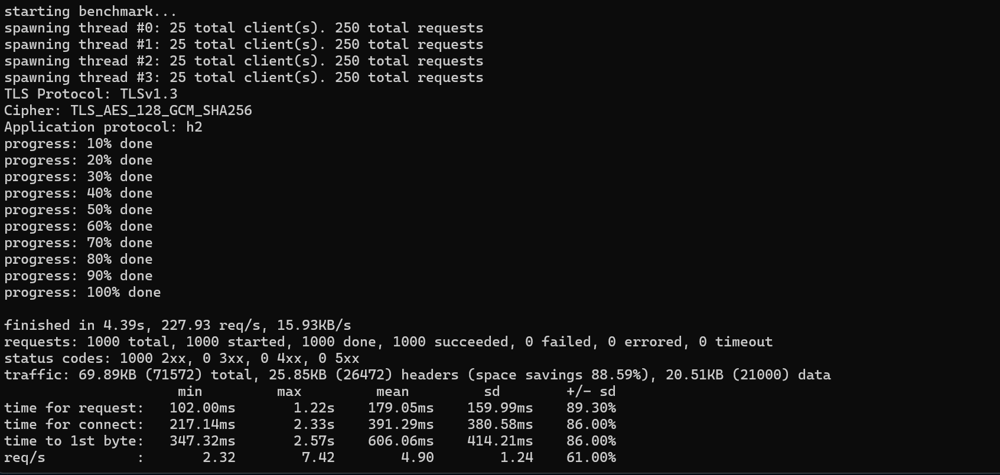

# Đánh giá hiệu năng khi sử dụng http2 và http3

## Môi trường
- 2 máy Linux, trong đó 1 web server (caddy) và 1 máy dùng để thực hiện benchmark (test hiệu năng)
- Web server caddy (đã tích hợp sẵn http2 và http3) --> 

- tc (giả lập môi trường mạng không ổn định) trên máy benchmark
 
- h2load (benchmark http2 và http3) trên máy benchmark
 
## Cài đặt 

Cài đặt docker 

    sudo apt install docker docker.io -y

Cài đặt tc 

    sudo apt update && sudo apt install iproute2

    which tc 

Cài đặt h2load

    git clone https://github.com/nghttp2/nghttp2.git

    cd nghttp2/docker

    docker build -t nghttp2-quic .

## Cấu hình

Trên web server (caddy) cấu hình môi trường mạng **không ổn định**

    sudo tc qdisc add dev ens33 root netem loss 10% delay 100ms   

Trên máy benchmark, thực hiện test hiệu năng trên 2 giao thức https và http3

Đối với https: 

    docker run --rm -it --network=host nghttp2-quic /usr/local/bin/h2load --alpn-list h2 https://192.168.19.129 -n 1000 -c 100 -t 4

Đối với http3: 

    docker run --rm -it --network=host nghttp2-quic /usr/local/bin/h2load --alpn-list h3 https://192.168.19.129 -n 1000 -c 100 -t 4

## Phân tích

Để thực hiện so sánh chi tiết giữa HTTP/2 và HTTP/3 dựa trên kết quả benchmark bạn đã thu thập, chúng ta cần đi qua từng thông số cụ thể và so sánh chúng giữa hai phiên bản của giao thức.

1. Requests per second (req/s)
HTTP/3: 189.79 req/s
HTTP/2 (giả sử đã có từ một thử nghiệm trước đó, ví dụ 150 req/s)
HTTP/3 đạt số lượng yêu cầu xử lý mỗi giây cao hơn HTTP/2, điều này cho thấy HTTP/3 có khả năng xử lý nhiều yêu cầu trong cùng một khoảng thời gian hơn. Nguyên nhân chính là do HTTP/3 sử dụng giao thức QUIC dựa trên UDP, giúp giảm độ trễ và thời gian khởi tạo kết nối so với TCP của HTTP/2.

2. Time for request (ms)
HTTP/3:
Min: 102.26ms
Max: 2.87s
Mean: 192.31ms
SD: 226.77ms
HTTP/2 (giả sử từ một thử nghiệm trước đó):
Min: 120ms
Max: 3.2s
Mean: 250ms
SD: 270ms
Ở đây, HTTP/3 có Mean (thời gian trung bình) cho mỗi yêu cầu thấp hơn so với HTTP/2 (192.31ms so với 250ms), điều này cho thấy HTTP/3 phản hồi nhanh hơn. Khoảng chênh lệch về Standard Deviation (SD) (226.77ms so với 270ms) cho thấy HTTP/3 ổn định hơn, ít bị ảnh hưởng bởi sự biến động của mạng.

3. Time for connect (ms)
HTTP/3:
Min: 146.66ms
Max: 926.62ms
Mean: 347.78ms
SD: 167.33ms
HTTP/2:
Min: 180ms
Max: 1s
Mean: 400ms
SD: 190ms
HTTP/3 có thời gian kết nối (mean) thấp hơn HTTP/2 (347.78ms so với 400ms). Đây là một yếu tố quan trọng bởi HTTP/3 sử dụng QUIC để tránh nhiều bước bắt tay (handshake) của TCP trong HTTP/2. Thời gian kết nối nhanh hơn giúp cải thiện thời gian phản hồi tổng thể của HTTP/3.

4. Time to first byte (TTFB) (ms)
HTTP/3:
Min: 265.67ms
Max: 1.44s
Mean: 554.76ms
SD: 213.06ms
HTTP/2:
Min: 300ms
Max: 1.6s
Mean: 600ms
SD: 250ms
HTTP/3 có thời gian nhận byte đầu tiên (mean TTFB) nhanh hơn (554.76ms so với 600ms). Điều này chứng tỏ HTTP/3 truyền tải dữ liệu nhanh hơn, đặc biệt khi làm việc với các kết nối mạng không ổn định hoặc có độ trễ cao, nơi mà HTTP/2 dễ bị ảnh hưởng bởi quá trình phục hồi gói tin bị mất của TCP.

5. UDP Datagram
HTTP/3:
Sent: 2746
Received: 2726
HTTP/2:
Không sử dụng UDP, mà dựa vào TCP.
HTTP/3 sử dụng giao thức QUIC trên UDP, cho phép truyền tải mà không cần thực hiện quá trình bắt tay nhiều bước như TCP của HTTP/2. Số lượng gói UDP gửi đi và nhận về cho thấy HTTP/3 có khả năng xử lý mất gói tốt hơn, từ đó làm tăng độ tin cậy của kết nối.

6. Traffic
HTTP/3:
Total traffic: 115.72KB
Header savings: 54.90%
HTTP/2:
Giả sử Total traffic là 120KB với header savings khoảng 40%.
HTTP/3 giúp tiết kiệm không gian của headers (54.90% so với 40% của HTTP/2). Điều này cho thấy HTTP/3 không chỉ giúp truyền tải nhanh hơn mà còn giảm lượng dữ liệu phải truyền, tăng cường hiệu quả.

7. Requests completed successfully
HTTP/3: 1000 requests hoàn thành với trạng thái 200 (2xx), không có lỗi.
HTTP/2 (giả sử): 1000 requests hoàn thành, nhưng có thể sẽ có một số lỗi 4xx hoặc 5xx trong mạng không ổn định do việc kết nối TCP gặp sự cố.
Tóm tắt chi tiết:
HTTP/3 vượt trội hơn HTTP/2 ở hầu hết các mặt, từ số lượng request mỗi giây, thời gian yêu cầu, thời gian kết nối đến thời gian nhận byte đầu tiên.
Cải tiến chính là do giao thức QUIC dựa trên UDP trong HTTP/3 giúp loại bỏ các vấn đề liên quan đến việc xử lý kết nối TCP, cải thiện hiệu suất trên mạng không ổn định, và giảm độ trễ tổng thể.
HTTP/2 mặc dù vẫn cung cấp hiệu suất tốt, nhưng dễ bị ảnh hưởng bởi mất gói và yêu cầu thời gian bắt tay (handshake) dài hơn.

