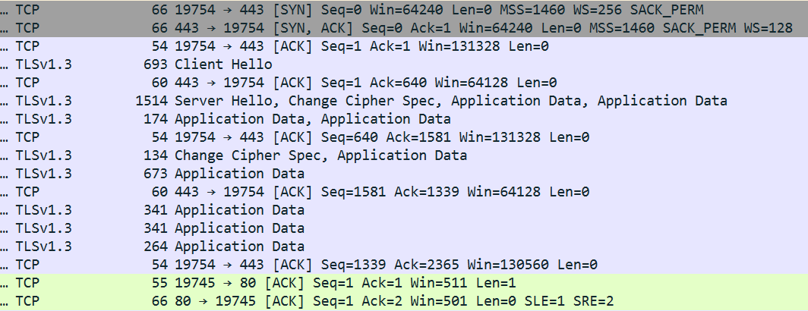

# Triển khai HTTPS và HTTP3/QUIC

## 1. Môi trường cài đặt

- Ubuntu 20.04 LTS

- Nginx - for https

- Caddy, Firefox - for http3

## 2. Triển khai https với nginx

- Cài đặt nginx trên ubuntu: 

        sudo apt update && sudo apt install nginx

        nginx -v # để kiểm tra cài đặt nginx thành công

- Tạo một self-signed certificate (chứng chỉ tự ký)

        sudo mkdir /etc/nginx/ssl # Tạo thư mục lưu chữ ký

        sudo openssl req -x509 -nodes -days 365 -newkey rsa:2048 -keyout /etc/nginx/ssl/selfsigned.key -out /etc/nginx/ssl/selfsigned.crt # sử dụng openssl để tạo chứng chỉ và khóa private

**Tại phần Common Name (CN), nhập địa chỉ của web server (địa chỉ của Ubuntu, vd: 192.168.19.129)**

        sudo openssl dhparam -out /etc/nginx/ssl/dhparam.pem 2048

- Cấu hình nginx để sử dụng https:

        sudo nano /etc/nginx/sites-available/default # chỉnh sửa file cài đặt của nginx

- Chỉnh sửa file cấu hình để nginx sử dụng chứng chỉ SSL tự ký ở trên, thay thế nội dung cũ bằng nội dung file [default](./config/default)

- Test file cấu hình và restart nginx

        sudo nginx -t # Kiểm tra file cấu hình, hiển thị successful có nghĩa là thành công

        sudo service nginx restart # restart nginx

        netstat -tlnp | grep 443 # Nếu có kết quả, https đã được triển khai thành công 

- Truy cập vào trang web

- Kiểm tra gói tin bằng pcap

## 3. Triển khai http3 với caddy

**Mặc định, caddy hỗ trợ sẵn HTTP3/QUIC, nên cần phải enable http3 phía trình duyệt**

- Enable http3 trên trình duyệt Firefox, truy cập ``about:config`` trên firefox, sau đó tìm đến mục ``network.http.http3.enabled``, chuyển sang **true**

- Stop nginx

        sudo systemctl stop nginx

- Cài đặt caddy trên ubuntu, sử dụng file cài đặt sau [setup](./config/install_caddy.sh)

- Truy cập trang web thông qua Firefox

